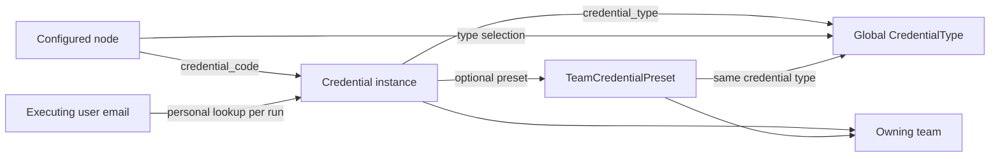

# Credentials and node types

This guide defines the required three-mode credential selection contract and
separately records implementation support checked on 2026-09-27 with SDK 0.2.1
and the local platform sources below. The existing team-only SDK lookup is an
implementation gap for the other modes, not a restriction on the required
product behavior. Read this guide before adding authentication to a node.

## Required selection modes

A node needing a user-configured credential must account for these three ways
of selecting it. They are explicit choices, not an automatic fallback chain.

| Mode | What the node stores | Runtime resolution |
| --- | --- | --- |
| Selected personal credential | The selected instance's `Credential.code`, with an explicit personal selection mode | Retrieve that particular personal credential in the authorized owner/team scope |
| Selected team credential | The selected instance's `Credential.code`, with an explicit team selection mode | Retrieve that particular active team credential (`user IS NULL`) in the execution team |
| Selected credential type | The selected `CredentialType.name`, with an explicit type selection mode | Derive the executing user's email from `user_id`, `user_email` or `email`, resolve that platform user, then find their active personal credential of the selected type within the execution team |

The mode names above describe behavior, not new SDK method names or established
manifest fields. Reuse existing platform configuration conventions where they
exist. If new fields are required, define and test their persisted format and
compatibility explicitly. Do not overload `credential_code` with a type name
or guess the mode from the reference string. Existing nodes without a new mode
field must retain their documented behavior until deliberately migrated.

For a selected personal credential, the saved code remains authoritative; type
resolution must not substitute another person's instance. Credential codes are
unique within a team/user scope, not globally, so the platform must retain or
resolve the authorized owner unambiguously. Do not select the first row with a
matching code across all users. For a selected team credential, a personal
credential must not shadow the explicit team selection.

### Resolve a type through the executing user's email

In type mode, resolve a credential on every execution rather than storing one
person's credential code during node configuration:

1. Obtain identity from the node's flow inputs: `user_id`, `user_email` or `email`.
   Each alias must work when supplied alone. `user_id` may already contain an
   email in platform flows; do not assume it is a numeric database ID. If the
   caller provides a platform user identifier instead, use the platform resolver
   to obtain that user's email. Do not treat arbitrary IDs as email addresses.
2. Apply the platform's email normalization and identity-resolution conventions.
   If several aliases are present, verify they identify the same user; report a
   conflict instead of silently choosing a different person's credential.
3. Resolve that email to a platform user and check that execution is authorized
   for that personal identity in the current team. An input email is an identity
   lookup key, not a grant to access anyone's credentials.
4. Resolve the exact active personal credential matching the selected type,
   execution team and resolved user. The internal platform helper
   `resolve_credential_by_type_exact(type_name, team_id, user_id)` expresses this
   database contract; it is a platform implementation reference, not a plugin
   import or a currently exposed SDK method.
5. No user, no matching credential, inactive credential or more than one match
   must produce a clear error before external I/O. Never silently use a team
   credential, the flow author's credential or an arbitrary first match.
6. Read the values with the existing preset/secret handling and apply the
   provider's supported authentication lifecycle. Type selection itself does
   not implement OAuth consent, token refresh or provider permissions.

### Deep Agent tool calls

A flow exposed as a Deep Agent tool is shared behavior. For example, if the
node selects a Microsoft credential type, a run for `alice@example.test` must
resolve Alice's personal credential; the same flow run for `bob@example.test`
must resolve Bob's. Neither run should require editing the saved node code.

Trace the entire handoff: caller identity → Deep Agent runtime → agent-flow tool
→ nested flow inputs → node → platform credential resolver. Forward the caller's
identity through input filtering, renaming and nested dispatch. Do not ask the
LLM to invent or select the executing user's email; preserve the established
caller context when constructing tool inputs.

The inspected `agent_flow_tools.py` preserves `user_id` in `_CONTEXT_KEYS`, but
not `user_email` or `email`. Verify that these aliases are normalized into the
preserved identity before dispatch, or extend and test their propagation. Do not
assume the email reached the node merely because it was present in the initial
request. The current plugin credential capability also needs support for passing
or resolving this authorized personal context; a form change alone is insufficient.

### Required acceptance cases

- All three selections survive save/load with the correct instance code or type.
- A selected personal code resolves that instance; a selected team code resolves
  the team instance even if a personal credential with the same code exists.
- Type mode works for each of `user_id`, `user_email` and `email` individually,
  including email-valued `user_id`; conflicting/unknown identities fail clearly.
- Two users invoking the same flow as a Deep Agent tool receive their own
  credentials without changing the node or leaking cached values between runs.
- Nested flow input filters preserve the identity; LLM-generated arguments do
  not replace the established caller context.
- Wrong team/owner/type, missing or inactive credentials, and multiple personal
  matches fail before I/O; there is no implicit personal-to-team fallback.
- Provider token lifecycle and secret-free errors/traces remain correct in all
  supported modes. Platform integration tests establish scope and identity;
  `FakeContext` alone cannot prove them.

## Four separate concepts

| Concept | Identifier / scope | Responsibility |
| --- | --- | --- |
| Node type | Manifest `code`, e.g. `example_catalog` | Public executable behavior and form definition; many nodes can use one credential type |
| Credential type | `CredentialType.name`, e.g. `agentKeyValueCredentials`; global | Defines properties, inheritance and credential-editor behavior, not an account or token |
| Credential instance | `Credential.code`, e.g. `catalog_test`; team and optional user | Configured, encrypted values for one connection; code-selection modes store this reference |
| Team credential preset | Separate record for a team and credential type | Supplies shared registration/configuration values by reference to linked credentials |



A node type and a credential type are not one-to-one. Reuse a type when its
schema and authentication lifecycle fit. A new node does not automatically need
a new type; a new provider type does not automatically implement token refresh.
Credential display names are human-readable labels. Credential codes are opaque
references: do not infer the type by splitting an auto-generated code prefix.
Database IDs differ between environments and must not be hardcoded in manifests.

A team preset is **not** a node template. Presets supply credential values;
node templates supply fixed node parameters. Neither is plugin executable code.
Keep credential types global: team-specific registrations belong in credentials
and presets, not duplicate types named after each customer/team.

## Editor lookups depend on selection mode

The personal and team instance pickers store `Credential.code`; a type picker
stores `CredentialType.name`. Filter all choices by supported types and active
state where applicable. Personal choices require an authorized owner scope;
`user__isnull: false` alone would include other users and is insufficient. Team
choices use `user__isnull: true`. Type selection is not a picker of one user's
credential instances. Verify the UI/API support for these distinct lookups.

The following example covers **only the selected team credential mode**, which
the inspected SDK already supports. It selects an existing team key/value credential. Its `secrets` map
must contain the `api_key` entry documented by the node. Add this field to
`form.fields`, include it in `form.layout` and translate it in both locales.

```yaml
- name: credential_code
  type: select
  label: Credential
  required: 1
  lookup:
    app_label: credentials
    model_name: Credential
    filter_operator: and
    filter:
      team: current_team_id
      is_active: true
      user__isnull: true
      credential_type__name: agentKeyValueCredentials
    field_value: code
    field_display: name
```

The runtime reference is the selected instance code, such as `catalog_test`,
not the literal type name `agentKeyValueCredentials`. Some platform-specific
Deep Agent paths happen to use a fixed credential code with that same spelling;
that is not the general plugin reference contract.

For several supported types, replace the single-name filter with
`credential_type__name__in: [typeA, typeB]` using real installed type names and an
explicit value mapping for every accepted shape. `extends` merges property
schemas, but these lookup filters match exact names; they do not automatically
include child types. The API implements the credential lookup specially in
`_resolve_credential_lookup`; the web form has its own rendering path. Check the
actual editor on a dev platform as well as validating YAML.

A filtered dropdown is a usability constraint, not runtime authorization or
runtime type enforcement. Saved/imported node parameters can contain a code that
the dropdown would not offer. The platform enforces team/active/team-credential
scope during lookup, but it currently does not compare the selected type against
the node's lookup filter. `credentials` grants access to eligible credentials in
that execution team; it is not an allowlist of particular codes from the form.
If exact runtime type enforcement is required, first extend and test the
platform/SDK contract; checking for a familiar key alone cannot prove a type.

## Current SDK support and implementation gaps

The functional requirement is all three selection modes above. In the inspected
SDK/platform version, `ctx.credentials.get()` only implements the team-instance
path. An agent must explicitly account for the missing personal-code and
personal-type support in the platform, host/SDK contract, forms and tests. Do
not claim three-mode support from a working team-only example.

Declare `capabilities: [credentials, http]` for a node that uses both methods.
The current team-instance flow is:

1. The plugin calls `await ctx.credentials.get(reference)`.
2. `CtxServer._credentials_get` takes the trusted execution team, not a team/user
   supplied in `inp.input_data` or node parameters.
3. It calls `get_credential_data_by_code(reference, team_id)` **without user_id**.
   Resolution therefore selects an active credential with `user_id IS NULL`
   in that team. Personal/delegated credentials are not exposed by this SDK call.
4. The platform decrypts the instance and overlays an applicable active preset's
   values. The plugin receives an SDK `Credential` with `reference` and `values`.
5. No team scope, missing/inactive credentials or lookup failures raise a
   capability error. Do not silently fall back to an inline token or another code.

The SDK model includes optional `type_name`, but the current handler and
`FakeContext` do not populate it; it defaults to `None`. There is no
`expected_type`, `team_id` or `user_id` argument to `get`, and no public SDK
credential write/refresh method. Do not invent these APIs in generated code.

The general platform helper supports user-to-team fallback when a caller passes
a user ID, and other helpers provide exact personal lookups. That does **not**
mean the current plugin capability exposes personal auth. Keep the required
input-driven personal resolution, but implement it through a supported platform
capability that validates the resolved identity and scope. Do not import private
helpers into the plugin or let the existing user-to-team fallback change the
meaning of an explicitly selected personal mode.

## Credential values keep their own schema

Only **node parameter names** are normalized by the platform. Credential values
are decrypted dictionaries with the original keys and nesting.

| Existing contract | Values to expect | Consequence |
| --- | --- | --- |
| OAuth provider types | For example `clientId`, `clientSecret`, `accessToken`, `refreshToken`, `expiresAt`; inspect the exact type and its parents | Reading values does not ensure a valid/refreshed access token |
| `agentKeyValueCredentials` | `{"secrets": {"api_key": "synthetic-value"}}` for this example | Read `values["secrets"]["api_key"]`; editor input rows are not the stored runtime shape |
| Current `input_restapi_json` override | `auth_type`, `auth_username`, `auth_password`, `auth_token`, `auth_custom_key`, `auth_custom_value` | This is the override's mapping, not a universal platform credential schema |

In particular, selecting an OAuth credential in the current REST override does
not translate `accessToken` to `auth_token`. Selecting a key/value credential
does not flatten `secrets` into those fields either. Its broad dropdown and legacy
inline secret fields must not be treated as the pattern for new integrations.
A new node must document and validate its supported value mapping explicitly.

Do not copy `Credential.values` wholesale into params, HTTP kwargs or headers.
Read only the intended keys. Reject malformed/missing values before I/O and use
fixed or deliberately validated API destinations so credential contents cannot
redirect a request to a different host. Do not expose values in error messages.

## Example: team API-key credential

The following `node.py` is a reference for a **new** static API-key integration,
not an OAuth adapter or a runnable provider integration. Replace the reserved
`.test` destination with the intended provider after checking its contract.
Use the lookup above, `capabilities: [credentials, http]`, `dependencies: []`,
`runtime.trace: decorator` and `runtime.manages_output_keys: false`.

```python
from limescape_plugin_sdk import NodeContext, NodeInput, NodeInputError


async def execute(ctx: NodeContext, inp: NodeInput):
    reference = inp.require_param("credential_code")
    if not isinstance(reference, str) or not reference.strip():
        raise NodeInputError("Select a team credential")
    credential = await ctx.credentials.get(reference)
    secrets = credential.values.get("secrets")
    token = secrets.get("api_key") if isinstance(secrets, dict) else None
    if not isinstance(token, str) or not token.strip():
        raise NodeInputError("Selected credential must contain secrets.api_key")
    response = await ctx.http.request(
        "GET",
        "https://api.example.test/v1/items",
        headers={"Authorization": f"Bearer {token}"},
        timeout=20,
    )
    if response.status != 200:
        raise NodeInputError(f"External API returned HTTP {response.status}")
    body = response.json()
    if not isinstance(body, dict) or not isinstance(body.get("items"), list):
        raise NodeInputError("External API returned an invalid items response")
    ctx.trace.event("items_received", {"count": len(body["items"])})
    yield {inp.output_key: body["items"]}
```

An adjacent `tests/test_node.py` can exercise that implementation without secrets
or network access:

```python
from pathlib import Path

from limescape_plugin_sdk.testing import FakeContext, run_node

NODE_DIR = Path(__file__).resolve().parents[1]


async def test_uses_selected_credential_without_exposing_secret():
    """Use the selected code, preserve the endpoint and expose only item data."""
    ctx = FakeContext(
        granted=["credentials", "http"],
        credentials={
            "catalog_test": {
                "secrets": {"api_key": "synthetic-example-key"},
                "endpoint_url": "https://wrong.example.test",
            }
        },
        http_responses=[{"status": 200, "json": {"items": [{"id": "demo"}]}}],
    )
    result = await run_node(
        NODE_DIR, ctx, params={"credential_code": "catalog_test"}, output_key="items"
    )
    assert result == [{"items": [{"id": "demo"}]}]
    assert ctx.calls[0].request == {"reference": "catalog_test"}
    assert ctx.calls[1].request["url"] == "https://api.example.test/v1/items"
    assert ctx.calls[1].request["headers"]["Authorization"] == "Bearer synthetic-example-key"
    assert "synthetic-example-key" not in repr((result, ctx.log.records, ctx.trace.events))


async def test_missing_credential_stops_before_http():
    """A bad reference produces an error without making an external request."""
    ctx = FakeContext(granted=["credentials", "http"])
    result = await run_node(NODE_DIR, ctx, params={"credential_code": "missing"})
    assert "error" in result[0]
    assert [call.capability for call in ctx.calls] == ["credentials"]
```

Add cases for malformed secret maps, empty/non-string keys, provider errors and
missing capabilities. Fake credentials map **instance codes to value dicts**,
not type names to `Credential` objects. Fake request records intentionally retain
synthetic headers for assertions; production logs must not record those headers.
This test does not prove UI filtering, runtime type identity or team isolation.

## Type creation, presets and OAuth prerequisites

A plugin manifest cannot register credential types. `NodeTypeManifest` has no
`credential_types` declaration. A genuinely new type needs a platform change:

- Define a stable global `CredentialType.name`, parent (if any), properties,
  required flags and safe non-secret defaults through a data migration.
- Make sensitive properties `password` (or the supported `secret-map` contract).
  The credential editor's secret protection is separate from plugin form fields;
  a password input in a node form does not turn a node parameter into a credential.
- Configure `show_in_frontend_users` / `show_in_frontend_team_admins` intentionally
  for personal and team creation. Document personal credential setup for modes 1
  and 3 and team credential setup for mode 2. Separate this required setup from
  the current plugin SDK's team-only implementation limitation.
- Verify schema inheritance, serialization/redaction and editor visibility.
  App-registration fields users must fill in should not accidentally be hidden
  by a type-level default; platform fixture-parity tests pin this behavior.
- Test the node lookup in the API and web editor, then the runtime mapping.
  Deploy/migrate the platform before asking users to select the new type.

A `TeamCredentialPreset` references the same type and team as its linked
credentials. Preset-owned values win on read; platform write paths strip them
before encrypting the credential again. This preserves rotation by reference.
The plugin consumes the merged values and must not cache them across executions
or copy them into saved node parameters. Do not assume type schema defaults,
legacy encrypted type defaults and active preset overlays are the same mechanism.
`get_credential_data` is specifically an instance read plus preset overlay.

OAuth/token-login needs more than `get()` and an `Authorization` header.
The current capability does not call `oauth2_helper`, Outlook's token helper or
`custom_api_helper`, refresh expired tokens, persist rotated refresh tokens,
perform consent, or enforce provider scopes/audience. Do not label an integration
OAuth-ready just because a synthetic access token works in a unit test.
If it needs those behaviors, define the missing platform capability and its
SDK/host/tests first, or use an already supported provider capability. For
example, `ctx.websearch.search()` keeps its platform-managed search credentials
on the platform; the plugin does not need to retrieve that API key.

## Sources to recheck in the platform

Paths are relative to the sibling `limescape-ai-platform` checkout. These are
implementation references, not modules a plugin may import.

| Source | Contract |
| --- | --- |
| `services/web/apps/credentials/models.py` | `CredentialType`, `Credential`, `TeamCredentialPreset`, inheritance, code uniqueness and preset/type/team validation |
| `services/web/apps/credentials/migrations/0019_deep_agent_key_value_credential_type.py` | `agentKeyValueCredentials` and the `secrets` property |
| `services/web/apps/credentials/tests/test_credential_type_fixture_parity.py` | Editable app-registration fields and secret-field semantics |
| `services/api/node_helpers/node_form_helper.py` (`_resolve_credential_lookup`) | Supported lookup filters and code/name options |
| `services/api/tests/test_node_form_helper.py` | Credential picker behavior and lookup integration |
| `packages/truelime-ai/src/truelime_ai/platform/plugins/ctx_server.py` (`_credentials_get`) | Actual SDK lookup, team-only scope and absent type metadata |
| `packages/truelime-ai/src/truelime_ai/platform/credentials/credential_helper.py` | `resolve_credential_by_code_exact`, `resolve_credential_by_type_exact`, ambiguity errors and instance reads |
| `packages/truelime-ai/src/truelime_ai/platform/agent_frameworks/deepagents/agent_flow_tools.py` | `_CONTEXT_KEYS`, caller identity propagation and nested flow input filtering |
| `packages/truelime-ai/src/truelime_ai/platform/credentials/presets.py` | Active matching preset overlay and symmetric stripping |
| `packages/truelime-ai/src/truelime_ai/platform/credentials/key_value_credentials.py` | Key/value storage shape; Deep Agent identity rules are a separate runtime path |
| `packages/limescape-plugin-sdk/src/limescape_plugin_sdk/context.py`, `capabilities.py`, `testing/fake_context.py` | `get(reference)`, `Credential`, capabilities and fake limitations |
| `docs/architecture/05-authentication-security.md` | Preset/rotation rationale and provider authentication context |
